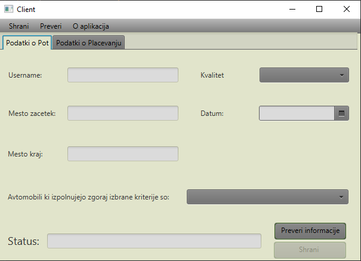
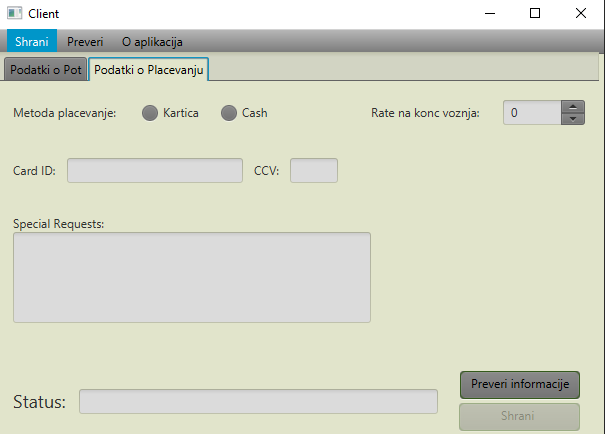
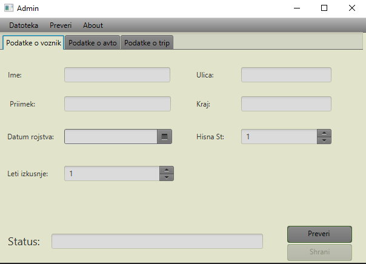
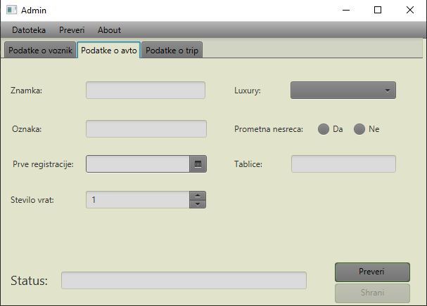

# CollabCar

## Summary
CollabCar is a project me and my colleague Grigor did, which is an information system that allows users to travel together with their cars by carpooling. 

## What is carpooling?
Carpooling is when several people travel together by car and share the cost of the journey. You probably already carpool very often with family and friends: every time you take the car together you share the cost of a journey with them. In much the same way, CollabCar connects car owners and co-travellers to share city-to-city journeys, so that they can share a long distance trip together, and both save money.

## How does CollabCar work?
### 1. Find a ride
Just enter your departure and arrival points and your travel date, then choose a car owner going your way. If you have a question, you can ask the car owner before booking.
Check out the car owners' trusted profiles, including ratings left for them by other members. 
2. Book online
Book your seat online. You’ll get the car owner's phone number to arrange the final details.
3. Travel together
Bring exact change to pay the car owner the agreed contribution during the ride or pay through credit card.
Remember to leave a rating for the car owner after the ride, it means they’re more likely to leave one for you!

## The details of our project
Our project was completely made in Java, using JavaFX for user interface.
It consists of two applications:

Client-side application;

and also the Admin-side application.

